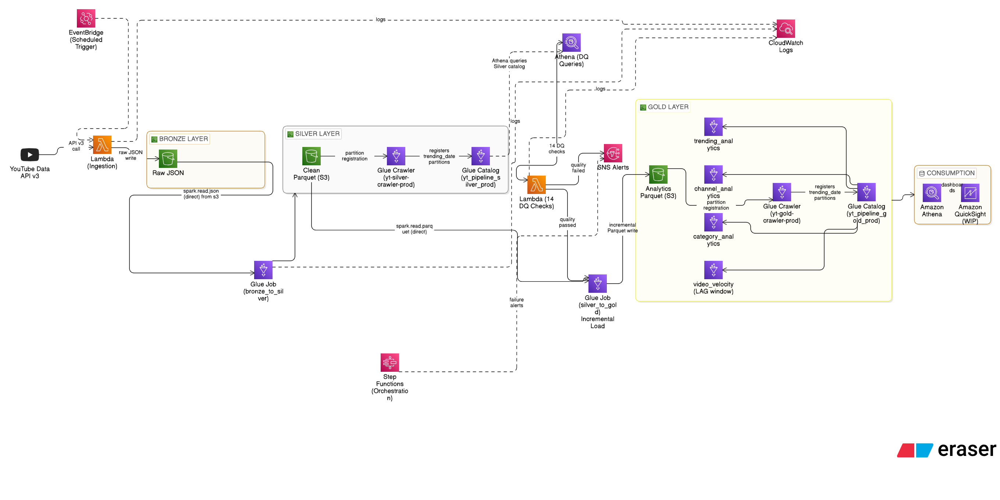
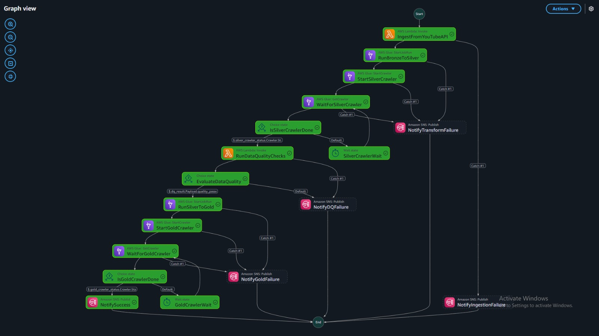

# YouTube Trending Data Pipeline 🎬

A production-grade, cloud-native data pipeline built on AWS that ingests live YouTube trending video data across 6 international regions, processes it through a medallion architecture (Bronze → Silver → Gold), enforces data quality gates, and produces analytics-ready aggregations queryable via Amazon Athena.

> **Stack:** YouTube Data API v3 · AWS Lambda · Amazon S3 · AWS Glue (PySpark) · AWS Step Functions · Amazon Athena · Amazon SNS · Amazon EventBridge · AWS Glue Crawler · AWS IAM · Amazon CloudWatch

---

## Table of Contents

- [Architecture](#architecture)
- [Pipeline Flow](#pipeline-flow)
- [Project Structure](#project-structure)
- [Gold Layer Tables](#gold-layer-tables)
- [Incremental Load Strategy](#incremental-load-strategy)
- [Data Quality Checks](#data-quality-checks)
- [Key Engineering Patterns](#key-engineering-patterns)
- [Sample Athena Queries](#sample-athena-queries)
- [Setup and Deployment](#setup-and-deployment)
- [Glue Job Parameters](#glue-job-parameters)
- [Environment Variables](#environment-variables)
- [Regions Covered](#regions-covered)
- [What I Would Improve Next](#what-i-would-improve-next)

---

## Regions Covered

| Code | Region |
|---|---|
| `us` | United States |
| `in` | India |
| `gb` | United Kingdom |
| `jp` | Japan |
| `kr` | South Korea |
| `ca` | Canada |




---
## Architecture

```
┌──────────────────────────────────────────────────────────────────────┐
│                          DATA SOURCE                                  │
│                YouTube Data API v3 (Live Ingestion)                  │
│            Top 50 Trending Videos × 6 Regions per run                │
└───────────────────────────────┬──────────────────────────────────────┘
                                │  EventBridge (scheduled trigger)
                                ▼
                       ┌─────────────────┐
                       │   AWS Lambda    │  Ingestion
                       │  (Ingestion)    │  · Fetches trending videos + categories
                       │                 │  · Writes raw JSON to Bronze S3
                       │                 │  · Per-region fault isolation (try/except loop)
                       └────────┬────────┘
                                │  writes raw JSON directly to S3
                                ▼
               ┌────────────────────────────────────────┐
               │         BRONZE LAYER (S3)              │
               │   Raw JSON — immutable, append-only    │
               │   youtube/raw_statistics/              │
               │     region={r}/date={d}/hour={h}/      │
               │   youtube/raw_statistics_reference_data/│
               │     region={r}/date={d}/               │
           
               └────────────────┬───────────────────────┘
                                │  Glue Job: bronze_to_silver.py
                                │  reads directly from Bronze S3 (spark.read.json)
                                │  · Per-region loop with fault isolation
                                │  · Flatten nested API JSON structure
                                │  · Schema enforcement + null handling
                                │  · Derived metrics: like_ratio, engagement_rate, views_tier
                                │  · Dedup window: latest record per video+region+date
                                │  · Part 2: category reference data → clean_reference_data
                                ▼
               ┌────────────────────────────────────────┐
               │         SILVER LAYER (S3)              │
               │   Clean Snappy Parquet                 │
               │   youtube/statistics/                  │
               │     region={r}/trending_date={d}/      │  ← clean_statistics
               │   youtube/reference_data/              │
               │     region={r}/                        │  ← clean_reference_data
               └────────────────┬───────────────────────┘
                                │  Glue Crawler: yt-silver-crawler-prod
                                │  · Triggered automatically by Step Functions
                                │  · Registers new trending_date= partitions
                                │  · Step Functions polls State=READY (30s loop)
                                │  · Keeps Silver catalog fresh for DQ Athena queries
                                │  → IN pipeline critical path
                                │
                                │  [Silver→Gold reads Silver S3 directly —
                                │   no catalog dependency for ETL]
                                ▼
                                │  Lambda: yt-data-pipeline-data-quality-prod
                                │  · 14 checks via Athena on Silver catalog tables
                                │  · Null %, row count, value ranges, enum validation
                                │  · Freshness check (skipped for reference data)
                                │  · Catalog guaranteed fresh — Silver crawler ran first
                                ▼
               ┌────────────────────────────────────────┐
               │         DATA QUALITY GATE              │
               │   quality_passed = true / false        │
               │   false → SNS alert + pipeline HALTS   │
               │   true  → Gold job proceeds            │
               └────────────────┬───────────────────────┘
                                │  Glue Job: silver_to_gold.py
                                │  reads directly from Silver S3 (spark.read.parquet)
                                │  · S3 scan to detect existing Gold partitions
                                │  · Incremental logic:
                                │      new_dates  → append to Gold
                                │      today      → overwrite in Gold (fresh counts)
                                │      history    → never touched
                                │  · LAG() on full Silver history → video_velocity
                                │  · Broadcast join: category lookup (~180 rows)
                                ▼
               ┌────────────────────────────────────────┐
               │         GOLD LAYER (S3)                │
               │   Analytics Snappy Parquet             │
               │   youtube/trending_analytics/          │
               │     region={r}/trending_date={d}/      │
               │   youtube/channel_analytics/           │
               │     region={r}/trending_date={d}/      │
               │   youtube/category_analytics/          │
               │     region={r}/trending_date={d}/      │
               │   youtube/video_velocity/              │
               │     region={r}/trending_date={d}/      │
               └────────────────┬───────────────────────┘
                                │  Glue Crawler: yt-gold-crawler-prod
                                │  · Triggered automatically by Step Functions
                                │  · Registers new trending_date= partitions
                                │  · Step Functions polls State=READY (30s loop)
                                │  · Makes new partitions queryable in Athena
                                │  → IN pipeline critical path
                                ▼
               ┌────────────────────────────────────────┐
               │           CONSUMPTION                  │
               │   Glue Catalog: yt_pipeline_gold_prod  │
               │   Amazon Athena — SQL queries          │
               │   Amazon QuickSight — dashboards (WIP) │
               └────────────────────────────────────────┘

  Orchestration : AWS Step Functions — linear state machine
                  Ingest → Bronze→Silver → StartSilverCrawler → PollSilverCrawler(loop)
                  → DQ → Choice → Silver→Gold → StartGoldCrawler → PollGoldCrawler(loop)
                  → NotifySuccess
                  Retry + Catch + SNS alert at every step

  Scheduling    : Amazon EventBridge cron rule (every 6 hours)
  Monitoring    : Amazon SNS — failure alerts at every step + success notification
  Logging       : Amazon CloudWatch — Lambda logs + Glue job logs

  Read strategy : Bronze→Silver reads Bronze S3 directly (spark.read.json)
                  Silver→Gold reads Silver S3 directly (spark.read.parquet)
                  Glue catalog used ONLY for DQ checks (Athena) and Gold consumption
                  No catalog dependency in ETL critical path
```

---

## Pipeline Flow

```
EventBridge (cron schedule)
        │
        ▼
[1] IngestFromYouTubeAPI        Lambda fetches trending videos + categories
        │                       for 6 regions via YouTube Data API v3.
        │                       Writes raw JSON to Bronze S3.
        │                       Retry: 3× with 30s exponential backoff.
        ▼
[2] RunBronzeToSilver           Single Glue PySpark job produces both Silver tables:
        │                       · clean_statistics  (flattened, deduped, metrics)
        │                       · clean_reference_data  (category ID→name lookup)
        │                       Both always written in same run → always in sync.
        │                       Retry: 2× with 60s backoff.
        ▼
[3] StartSilverCrawler          Starts Glue crawler (yt-silver-crawler-prod).
        │                       Registers new trending_date partitions in Silver
        │                       Glue catalog so DQ Lambda Athena queries run against
        │                       fresh, complete data — not stale catalog entries.
        ▼
[4] WaitForSilverCrawler        Polls getCrawler every 30 seconds until State = READY.
        │                       (Step Functions has no native crawler.sync integration.)
        ▼
[5] RunDataQualityChecks        Lambda runs 14 checks across both Silver tables
        │                       via Athena queries. Failed checks → SNS alert.
        ▼
[6] EvaluateDataQuality         Step Functions Choice state.
        │                       quality_passed = true  → continue to Gold.
        │                       quality_passed = false → NotifyDQFailure + HALT.
        ▼
[7] RunSilverToGold             Glue PySpark job with incremental load pattern:
        │                       · Scans Gold S3 for existing trending_date partitions.
        │                       · Appends only new dates (never seen in Gold before).
        │                       · Always overwrites today (fresher view counts).
        │                       · Never touches historical partitions.
        │                       · LAG() computed on full Silver history for velocity.
        │                       Retry: 2× with 60s backoff.
        ▼
[8] StartGoldCrawler            Starts Glue crawler (yt-gold-crawler-prod).
        │                       Registers new trending_date partitions in Gold Glue
        │                       catalog so Athena can query them immediately.
        ▼
[9] WaitForGoldCrawler          Polls getCrawler every 30 seconds until State = READY.
        │                       (Step Functions has no native crawler.sync integration.)
        ▼
[10] NotifySuccess              SNS email with execution summary.
```

---

## Project Structure

```
youtube-trending-pipeline/
│
├── lambdas/
│   ├── ingestion/
│   │   └── lambda_function.py         # YouTube API fetch + Bronze S3 write
│   └── data_quality/
│       └── lambda_function.py         # 14-check DQ gate via Athena
│
├── glue_jobs/
│   ├── bronze_to_silver.py            # PySpark: flatten, cleanse, dedup → Silver
│   └── silver_to_gold.py             # PySpark: incremental join + aggregate → 4 Gold tables
│
├── step_functions/
│   └── pipeline_orchestration.json   # State machine with crawler polling loop
│
├── DECISIONS.md                       # Engineering design decisions and tradeoffs
└── README.md
```

---

## Gold Layer Tables

All Gold tables are partitioned by **region + trending_date** for efficient Athena partition pruning.

### 1. `trending_analytics`
Daily regional summary of trending video performance. One row per region per date.

| Column | Type | Description |
|---|---|---|
| `region` | string | Region code (us, in, gb, jp, kr, ca) |
| `trending_date` | string | Date of trending snapshot |
| `total_videos` | bigint | Number of trending videos that day |
| `total_views` | bigint | Aggregate view count |
| `avg_engagement_rate` | double | Average (likes + comments) / views × 100 |
| `avg_like_ratio` | double | Average likes / views × 100 |
| `unique_channels` | bigint | Distinct channels in trending that day |
| `unique_categories` | bigint | Distinct content categories in trending |
| `hd_percentage` | double | % of trending videos in HD definition |
| `mega_count` | bigint | Videos with 100M+ views |
| `viral_count` | bigint | Videos with 10M–100M views |
| `popular_count` | bigint | Videos with 1M–10M views |
| `trending_count` | bigint | Videos with 100K–1M views |
| `emerging_count` | bigint | Videos with <100K views |

---

### 2. `channel_analytics`
Channel-level performance metrics with regional ranking. One row per channel per region per date.

| Column | Type | Description |
|---|---|---|
| `channel_title` | string | YouTube channel name |
| `region` | string | Region code |
| `trending_date` | string | Date of snapshot |
| `total_videos` | bigint | Distinct videos trending that day |
| `total_views` | bigint | Total views across all trending videos |
| `peak_views` | bigint | Highest single-video view count |
| `avg_engagement_rate` | double | Average engagement across all videos |
| `rank_in_region` | int | Channel ranked by total views within region+date |
| `times_trending` | bigint | Distinct dates this channel appeared in trending |
| `first_trending_date` | date | First date seen in trending |
| `last_trending_date` | date | Most recent trending date |
| `categories` | array | Content categories this channel covers |
| `primary_views_tier` | string | Most common views tier for this channel |

---

### 3. `category_analytics`
Category-level performance over time with view share percentage. One row per category per region per date.

| Column | Type | Description |
|---|---|---|
| `category_name` | string | Content category (Gaming, Music, Entertainment...) |
| `category_id` | bigint | YouTube category ID |
| `region` | string | Region code |
| `trending_date` | string | Date of snapshot |
| `video_count` | bigint | Videos in this category that day |
| `total_views` | bigint | Total views for this category |
| `view_share_pct` | double | Category's % of total regional views that day |
| `avg_engagement_rate` | double | Average engagement for this category |
| `rank_on_day` | int | Category ranked by views within region+date |
| `unique_channels` | bigint | Distinct channels in this category |
| `hd_percentage` | double | % of HD videos in this category |

---

### 4. `video_velocity` *(original — not in base tutorial)*
Measures view and like growth for videos appearing across multiple trending snapshots. Uses `LAG()` window function to compute day-over-day momentum. Only contains videos that have trended on 2+ days.

| Column | Type | Description |
|---|---|---|
| `video_id` | string | YouTube video ID |
| `title` | string | Video title |
| `channel_title` | string | Channel name |
| `category_name` | string | Content category |
| `region` | string | Region code |
| `trending_date` | string | Current snapshot date |
| `prev_trending_date` | date | Previous date this video appeared in trending |
| `days_since_prev` | int | Days between current and previous trending appearance |
| `views` | bigint | Current view count |
| `prev_views` | bigint | View count on previous trending date |
| `view_delta` | bigint | Views gained since last trending appearance |
| `view_growth_pct` | double | % growth in views |
| `views_per_day` | double | Average daily view gain since last appearance |
| `like_delta` | bigint | Likes gained since last appearance |
| `momentum` | string | surging / growing / stable / declining / fading |

**Momentum labels:**
| Label | Condition |
|---|---|
| `surging` | 20%+ view growth |
| `growing` | 5–20% growth |
| `stable` | -5% to +5% |
| `declining` | -5% to -20% |
| `fading` | below -20% |

---

## Incremental Load Strategy

The Silver→Gold job implements a careful incremental pattern to avoid reprocessing historical data on every run while always reflecting the freshest view counts for today.

```
new_dates      = silver_dates - gold_existing_dates   → append to Gold
today_dates    = {TODAY} if TODAY in silver_dates      → overwrite in Gold
dates_to_process = new_dates | today_dates
```

**Why today is always overwritten:** The ingestion Lambda runs multiple times per day (every 6 hours). Each run captures updated view counts. If today's Gold partition were not overwritten, it would hold the first run's counts from 6am and never update — defeating the purpose of intraday ingestion.

**Why historical dates are never touched:** Once a day's trending data is finalized, reprocessing it would either append duplicates (with `mode=append`) or trigger a full table overwrite (with `mode=overwrite`). Neither is acceptable. The S3 scan approach — checking which `trending_date=` partition folders already exist in Gold — is used as ground truth rather than the Glue catalog, since newly written partitions may not be registered in the catalog yet.

**Run examples:**
```
Run 1 (May 18): Silver=[18]     Gold=[]       → process [18], append   → Gold=[18]
Run 2 (May 19): Silver=[18,19]  Gold=[18]     → process [19], append   → Gold=[18,19]
Run 3 (May 19): Silver=[18,19]  Gold=[18,19]  → process [19], overwrite → Gold=[18,19] ✅ fresh
```

**video_velocity special case:** The `LAG()` window function that computes `prev_views` requires the full Silver history to be loaded — not just the incremental slice. If only today's data is passed to `LAG()`, there is no previous row in the window and `prev_views` is always NULL, producing an empty table. The fix: compute `LAG()` across all Silver history first, then filter to `dates_to_process` after.

---

## Data Quality Checks

14 checks run across both Silver tables via Athena before Gold aggregation proceeds.

| Check | Table | What It Validates |
|---|---|---|
| Row count | both | Minimum 10 rows present |
| Null % | clean_statistics | video_id, title, channel_title, category_id, views, region, trending_date, engagement_rate, views_tier ≤ 5% null |
| Null % | clean_reference_data | category_id, category_name, region ≤ 5% null |
| Schema | both | All critical columns present |
| Value range | clean_statistics | No negative views, no views > 50B |
| Value range | clean_statistics | engagement_rate and like_ratio between 0–100 |
| Enum validation | clean_statistics | views_tier only valid values |
| Enum validation | clean_statistics | region only configured regions |
| Freshness | clean_statistics | Latest record within 48 hours |
| Freshness | clean_reference_data | **Skipped** — static reference data, would always false-positive |

If `quality_passed = false`:
- Step Functions halts at the Choice state
- Gold job does **not** run
- SNS alert sent with full check details and list of failed checks

---

## Key Engineering Patterns

### Incremental Gold Load
Gold is never fully overwritten on each run. The job scans existing Gold S3 partition folders to determine which dates have already been processed, appends only new dates, and overwrites only today's partition for fresh view counts. Historical partitions are never touched.

---

### Automatic Partition Registration via Glue Crawler
After every Gold write, the Step Functions state machine starts the Gold Glue crawler (`yt-gold-crawler-prod`) and polls its status every 30 seconds until `State = READY`. This automatically registers new `trending_date=` partitions in the Glue catalog, making them immediately queryable in Athena without manual `MSCK REPAIR TABLE`. Step Functions has no native `crawler.sync` integration (unlike Glue jobs), so a polling loop with a `Wait` state is the correct AWS-native pattern.

---

### Idempotency
Every layer is idempotent — re-running the pipeline for the same partition produces identical results without duplicates.

- **Bronze:** Hive-style partitioning (`region+date+hour`) maps to a unique S3 prefix. Re-ingesting the same hour overwrites the same files.
- **Silver:** `partitionOverwriteMode=dynamic` with `mode("overwrite")`. Only partitions in the current write are replaced — other partitions untouched.
- **Silver deduplication:** Window function on `video_id + region + trending_date` ordered by `ingestion_timestamp DESC` keeps only the latest record per video per day.
- **Gold:** Split write — today's partition overwritten with fresh counts, new historical dates appended once and never touched again.

---

### Per-Region Fault Isolation
The ingestion Lambda and Bronze→Silver Glue job both process regions independently in try/except loops. A failed response for one region (e.g. API quota exceeded for JP) is caught, logged to CloudWatch, and skipped — the other 5 regions continue. This prevents one bad region from killing the entire pipeline run.

---

### Consolidated Silver Transform
Both Silver outputs (`clean_statistics` and `clean_reference_data`) are produced by a single Glue job rather than separate processes. This ensures both tables are always in sync — there is no state where statistics are updated but category names are not. It also eliminates one Lambda, one IAM role, and one Step Functions parallel branch from the original tutorial architecture.

---

### Broadcast Join for Category Lookup
The category reference table (~180 rows across 6 regions) is broadcast to all Spark executors rather than shuffled in a sort-merge join. For a tiny lookup table this eliminates all data movement across the cluster.

```python
stats_df = stats_df.join(
    F.broadcast(category_lookup),
    on="category_id",
    how="left",
)
```

---

### Direct S3 Reads — No Catalog Dependency in ETL Path
Both Glue jobs read their source data directly from S3 using `spark.read` rather than via the Glue catalog (`create_dynamic_frame.from_catalog`).

```python
# Bronze→Silver reads Bronze S3 directly
region_df = spark.read.option("multiLine", "true").json(region_path)

# Silver→Gold reads Silver S3 directly
stats_df = spark.read.format("parquet").load(f"s3://{SILVER_BUCKET}/youtube/statistics/")
ref_df   = spark.read.format("parquet").load(f"s3://{SILVER_BUCKET}/youtube/reference_data/")
```

This eliminates a class of bugs where the Glue catalog is stale — a new partition written to S3 isn't registered in the catalog yet because a crawler hasn't run or `MSCK REPAIR TABLE` hasn't been executed. S3 is always ground truth. The Glue catalog is used for only two things: DQ checks (Athena queries Silver catalog tables) and Gold consumption (Athena queries Gold catalog tables after the Gold crawler runs).

This also means the `video_velocity` LAG() window always has access to the full Silver history — no bookmarking mechanism can accidentally restrict the read to only new files.

---

### Dual Partition Key on Silver Statistics
Silver statistics are partitioned by both `region` AND `trending_date`. With region-only partitioning, a query like "US data for last 7 days" scans all US data ever collected. With dual-key partitioning, Athena opens only the 7 relevant date folders — reducing both scan cost and latency.

---

### Non-Fatal Category Failure in Gold
If the category reference table fails to load in the Silver→Gold job, the job continues with `category_name = 'Unknown'` rather than failing. Statistics data is the primary fact — losing category names for one run is acceptable and recoverable on the next run. Failing the entire Gold job is not.

---

## Business Queries on Athena

### 1. Which creators consistently trend across regions?

```sql
--Identifies creators with sustained regional presence and high audience reach across multiple markets

SELECT channel_title, 
    COUNT(DISTINCT region) AS regions_trended, 
    SUM(total_views) AS total_views, 
    SUM(total_videos) AS total_trending_videos 
FROM yt_pipeline_gold_prod.channel_analytics
GROUP BY channel_title 
ORDER BY total_views DESC LIMIT 10;
```

---

### 2. Which categories dominate engagement in each market?
```sql
-- Shows which content categories generate the strongest audience engagement in each region.

SELECT region, 
    category_name, 
    SUM(total_views) AS total_views, 
    AVG(avg_engagement_rate) AS avg_engagement 
FROM yt_pipeline_gold_prod.category_analytics 
GROUP BY region, category_name 
ORDER BY region, total_views DESC;
```

---

### 3. Top 10 Channels per Region — Latest Day
```sql
SELECT
    region,
    rank_in_region,
    channel_title,
    total_videos,
    ROUND(total_views / 1000000.0, 2) AS total_views_millions,
    ROUND(avg_engagement_rate, 4)     AS avg_engagement_rate,
    primary_views_tier,
    categories
FROM yt_pipeline_gold_prod.channel_analytics
WHERE trending_date = (
    SELECT MAX(trending_date) FROM yt_pipeline_gold_prod.channel_analytics
)
  AND rank_in_region <= 10
ORDER BY region, rank_in_region;
```

---

### 4. Which videos are still gaining momentum right now?
```sql
--Which videos are still gaining momentum right now?

SELECT title, 
    region, 
    views, 
    view_growth_pct, 
    momentum 
FROM yt_pipeline_gold_prod.video_velocity 
WHERE momentum IN ('surging', 'growing') ORDER BY view_growth_pct DESC LIMIT 20;
```

---

### 5. Which regions show the highest audience interaction?
```sql
-- Measures which regions have the most active and engaged YouTube audiences.
SELECT
    region,
    ROUND(AVG(avg_engagement_rate),2) AS avg_engagement_rate,
    SUM(total_comments) AS total_comments,
    SUM(total_likes) AS total_likes
FROM yt_pipeline_gold_prod.trending_analytics
GROUP BY region
ORDER BY avg_engagement_rate DESC;
```

---

### 6. Which trends are sustainable vs one-time spikes?
```sql
-- Differentiates long-term trending content from short-lived viral spikes using growth momentum analysis.

SELECT 
    momentum, 
    COUNT(*) AS video_count, 
    AVG(view_growth_pct) AS avg_growth_pct 
    FROM yt_pipeline_gold_prod.video_velocity 
    GROUP BY momentum 
ORDER BY avg_growth_pct DESC;
```

---

### 7.  Which channels generate the highest average views per trending video?
```sql
-- Identifies creators whose videos consistently perform well rather than relying on isolated viral hits.

SELECT
    channel_title,
    ROUND(AVG(avg_views_per_video),1) AS avg_views,
    SUM(total_videos) AS total_videos
FROM yt_pipeline_gold_prod.channel_analytics
GROUP BY channel_title
HAVING SUM(total_videos) >= 3
ORDER BY avg_views DESC
LIMIT 10;
```

---

### 8.  Which videos are rapidly losing momentum after trending?
```sql
-- Highlights videos whose audience growth is slowing down after initial virality.
SELECT 
    title, 
    region, 
    view_growth_pct, 
    momentum 
FROM yt_pipeline_gold_prod.video_velocity 
WHERE momentum IN ('declining', 'fading')
ORDER BY view_growth_pct ASC LIMIT 20;
```

---

## What I Would Improve Next

**Backfill mechanism** — Add a `backfill_mode` boolean and `backfill_date_range` to the Step Functions input payload so the ingestion Lambda can re-fetch data for a specific date range. Currently there is no clean way to recover a missed day without manually re-running each step.

**Replace DQ LIMIT with TABLESAMPLE** — The DQ Lambda uses `LIMIT 10000` for Athena sampling. At scale this should be `TABLESAMPLE BERNOULLI(10)` for a percentage-based sample without a hardcoded row ceiling.

**CloudWatch custom metric for data freshness** — A Lambda that publishes a CloudWatch metric if Bronze hasn't received new data in 6+ hours, catching API key expiry or quota exhaustion before the pipeline runs.


